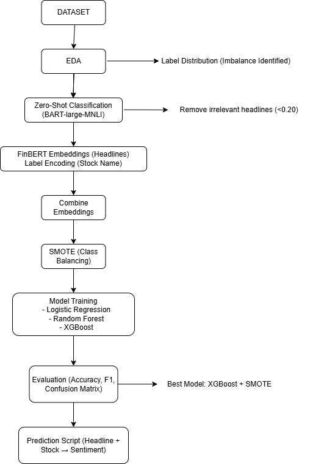
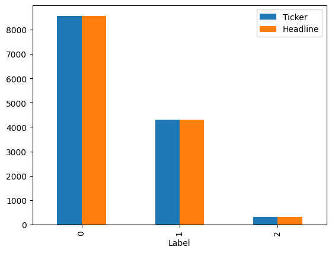
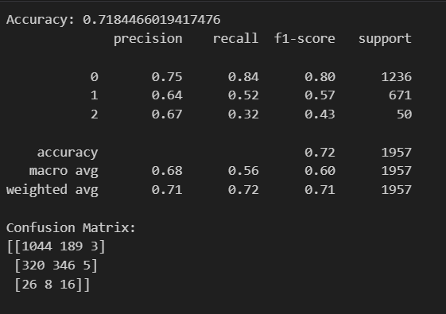
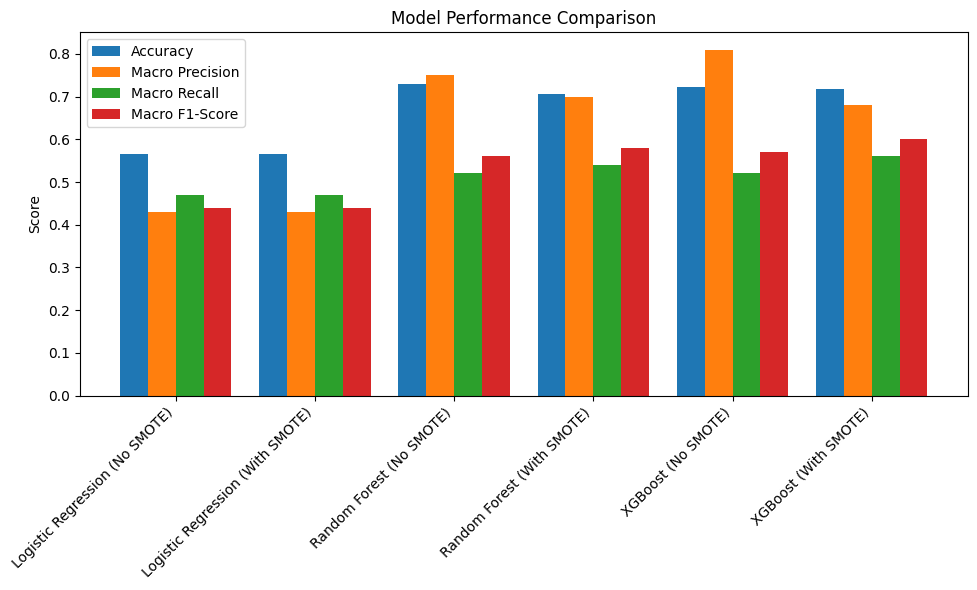
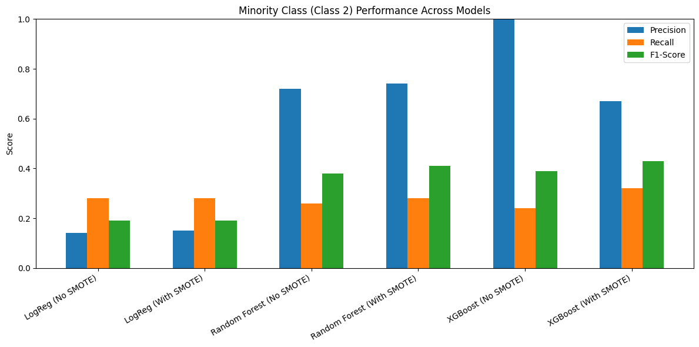

# Stock-mov-prediction
## Overview

This project predicts the impact of news headlines on stock prices by analyzing financial sentiment and relevance using Natural Language Processing (NLP) and Machine Learning.
It combines Zero-Shot Classification, FinBERT embeddings, SMOTE balancing, and XGBoost modeling to classify whether a headline is likely to cause a stock to rise, fall, or stay neutral.

A complete Python pipeline allows users to input any stock name and headline to receive a prediction.

### 🔄 Project Pipeline

## Dataset

Source: Kaggle – News Sentiment Analysis for Stock Data by Company

Description:
The dataset contains company names, corresponding stock-related news headlines, and sentiment labels:

0 → Negative sentiment

1 → Neutral sentiment

2 → Positive sentiment

## Project Workflow
### 1. Exploratory Data Analysis (EDA)

Analyzed dataset structure, missing values, and label distribution.

Found significant class imbalance — Label 0 (negative) dominated, while Label 2 (positive) was underrepresented.

Visualized imbalance using a bar plot.

### 2. Zero-Shot Classification (Relevance Filtering)

Used facebook/bart-large-mnli model to determine relevance of each headline to stock-market-related topics:

"stock market", "finance", "company news", "business", "economy", "politics", "entertainment"

Headlines scoring below 0.20 across all topics were considered irrelevant and removed to improve data quality.

### 3. Feature Engineering & Embeddings

Applied Label Encoding for stock names.

Used Yiyanghkust/FinBERT-Tone model to extract financial tone embeddings from headlines.

Combined both embeddings (headline + stock name) for final model input.

### 4. Handling Data Imbalance

Applied SMOTE (Synthetic Minority Oversampling Technique) to balance sentiment labels.

### 5. Model Training

Trained and compared multiple models:

Logistic Regression	with and without SMOTE
Random Forest	with and without SMOTE
XGBoost with and without SMOTE

### 6. Model Evaluation

Evaluated all models using:

Accuracy Score

Confusion Matrix

Classification Report

Result:
XGBoost with SMOTE achieved the best overall performance and was selected as the final model. Even though XGboost without SMOTE acheived better accuracy it was at the cost of reduced recall for minority labels like 1 and 2. Thus compromising small precision we choose the model that provides better performance in minority samples. However due to the existing imbalance in dataset, the machine might struglle or even fail to accurately predict minority sample speicially label 2.

### 7. Deployment Pipeline

Built a Python script integrating the full pipeline:

Input: Stock name and headline

Output: Model predicts if the headline will likely cause the stock to rise, fall, or remain neutral.

## Key Insights

Filtering irrelevant news greatly improved model performance.

SMOTE effectively balanced the dataset and reduced bias toward the majority class.

XGBoost performed best in handling complex, non-linear relationships between text sentiment and market response.

FinBERT embeddings captured subtle financial tones more effectively than general-purpose NLP embeddings.

## Tools & Technologies

Languages: Python

Libraries: pandas, numpy, matplotlib, seaborn, scikit-learn, xgboost, imbalanced-learn

NLP Models: facebook/bart-large-mnli, Yiyanghkust/FinBERT-Tone

Techniques: SMOTE balancing, Zero-Shot Classification, Embeddings, Logistic Regression, Random Forest, XGBoost

## Skills Demonstrated

Natural Language Processing (NLP)

Text embeddings and transformer models

Model evaluation and selection

Imbalanced data handling using SMOTE

Building modular ML pipelines

Model interpretability and deployment

### Model Comparison

### Minority performance

